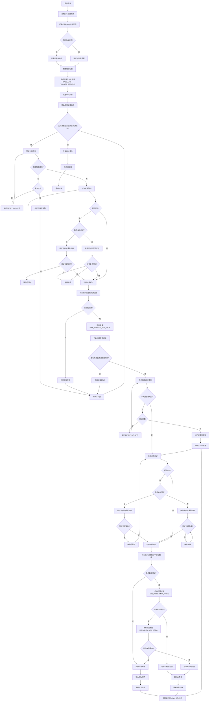
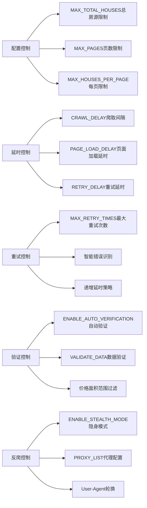
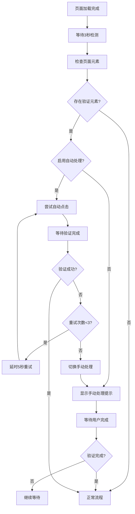

# 安居客爬虫程序运行流程图

## 🎯 完整程序运行流程

## 📊 核心控制流程

## 🔄 反爬验证处理详情

## 🎯 关键流程节点说明

### 1. **初始化阶段**
- 读取.env中25个配置项
- 根据ENABLE_STEALTH_MODE设置反爬参数
- 配置PROXY_LIST代理
- 生成BASE_URL+TARGET_REGIONS的URL列表

### 2. **列表页处理**
- 反爬验证检测和处理
- JavaScript提取房源链接
- 限制MAX_HOUSES_PER_PAGE个房源
- 失败重试机制

### 3. **详情页处理**
- 反爬验证检测和处理
- JavaScript提取22个字段
- 价格面积范围验证
- 写入CSV文件

### 4. **控制机制**
- MAX_TOTAL_HOUSES总房源数限制
- CRAWL_DELAY智能延时
- MAX_RETRY_TIMES重试机制
- 详细的进度日志

### 5. **反爬验证**
- 自动检测验证码元素
- 自动处理和手动处理两种模式
- 重试和降级策略

---

## 📋 配置项使用情况

✅ **全部25个.env配置项都已采用**，包括：
- 浏览器配置、爬取配置、输出配置
- 日志配置、反爬配置、数据验证配置
- 区域化URL生成和智能控制机制

整个程序实现了完整的"加载一页房源列表→爬取该页所有详情"工作流程，具备完善的反爬验证处理机制。